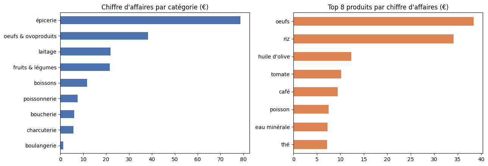

# Data Mining — ECE Paris (2025/2026)

Projet réalisé dans le module **Data Mining** du cycle ingénieur de l'ECE Paris (majeure Data & IA), pendant l'année 2025/2026.

**Stack :** Python · pandas · NumPy · Matplotlib · Jupyter

---

## Préparation et contrôle qualité de données d'achats

📓 [`preparation-donnees-achats/nettoyage_donnees_achats.ipynb`](preparation-donnees-achats/nettoyage_donnees_achats.ipynb)

**Contexte :** un fichier Excel de transactions d'un magasin alimentaire, saisi à la main, qui cumule les défauts typiques des données réelles. Objectif : le rendre fiable et exploitable, en suivant la phase *Data Preparation* de la méthodologie CRISP-DM.

**Démarche :**

1. **Pipeline de nettoyage** : audit (types, valeurs manquantes, doublons, cardinalités), suppression des doublons, harmonisation des libellés par dictionnaires de correspondance, parsing de dates saisies dans des formats mélangés, imputation des valeurs manquantes, filtrage des valeurs hors bornes.
2. **Contrôle qualité du résultat** : relecture critique du fichier produit, qui révèle des erreurs silencieuses que le pipeline n'avait pas vues : 28 dates avec jour et mois inversés, synonymes restants, un prix 8 fois trop élevé, des ventes ressaisies sous un autre identifiant.
3. **Analyse descriptive** : chiffre d'affaires par catégorie, par produit et par jour.

| | Avant | Après |
|---|---|---|
| Transactions | 51 lignes brutes | 41 transactions fiables |
| Catégories | 22 libellés | 9 catégories |
| Produits | 40 libellés | 24 produits |
| Dates | formats mélangés, 28 inversions jour/mois | format unique, 1er au 12 septembre 2025 |



**Points clés :**
- Un premier nettoyage qui « a l'air propre » peut encore contenir des erreurs : il faut **contrôler le résultat**, pas seulement exécuter le pipeline.
- Chaque correction repose sur une règle explicite. Les hypothèses invérifiables, comme le traitement des doubles saisies, sont documentées pour validation par le métier.
- Détecter les aberrations **par produit** (écart au prix médian) plutôt qu'avec un seuil global.

## Organisation

```
preparation-donnees-achats/
├── nettoyage_donnees_achats.ipynb
├── data/
│   ├── donnees_achats_propres.xlsx   # sortie du pipeline de nettoyage (partie 1)
│   └── donnees_achats_final.csv      # jeu final après contrôle qualité (partie 2)
└── images/
```

Le fichier brut fourni en cours n'est pas publié. Les parties 2 et 3 s'exécutent entièrement à partir de `data/donnees_achats_propres.xlsx`.

```bash
pip install -r requirements.txt
jupyter lab   # ouvrir le notebook depuis le dossier preparation-donnees-achats
```

## Auteur

**Édouard Menut**. Autres projets : [Machine Learning 1 & 2](https://github.com/Edouardmnt/ECE-Machine-Learning-2025-2026).
